# restaurant-management-system
## Choose Language / Escolha a Linguagem
- [Português Brasileiro](#português)
- [English](#english)

## Português

## Sumário
- [Descrição](#descrição)

 
Metodologia

- [Visão geral da metodologia](docs/metodologia.md#visão-geral-da-metodologia)
- [Fases do processo (resumo)](docs/metodologia.md#fases-do-processo-resumo)
- [Análise de Similares](docs/metodologia.md#1-análise-de-similares-página-7)
- [Público-alvo](docs/metodologia.md#2-público-alvo-página-23)
- [Personas](docs/metodologia.md#3-personas-página-24)
- [Escopo](docs/metodologia.md#4-escopo-página-28)
- [Lista de requisitos e restrições](docs/metodologia.md#5-lista-de-requisitos-e-restrições-página-29)
- [Documentação técnica](docs/metodologia.md#documentação-técnica-apartir-da-página-32)
- [Funcionalidades](docs/metodologia.md#6-lista-de-requisitos-e-funcionalidades-página-32)
- [Lista de eventos](docs/metodologia.md#7-lista-de-eventos-página-52)
- [Diagrama de contexto](docs/metodologia.md#8-diagrama-de-contexto-página-57)
- [DFD nível 0](docs/metodologia.md#9-dfd-nível-0-página-58)
- [Mapa do site](docs/metodologia.md#10-mapa-do-site-página-62)
- [Modelo do Banco de Dados](docs/metodologia.md#11-modelo-do-banco-de-dados-página-70)
- [Guia de estilos](docs/metodologia.md#12-guia-de-estilos-página-72)
- [Design](docs/metodologia.md#13-design-página-75)

- [Funcionalidades](docs/funcionalidades.md)
- [Design](design/design.md)
- [Solução](docs/solucao.md)
- [Relatório do TCC](docs/relatorio.pdf)

## Descrição
Sistema de gerenciamento para restaurantes desenvolvido como projeto de conclusão de curso (TCC), com controle de estoque, comandas, gerenciamento de funcionários e estatísticas do negócio.

O foco do projeto é captar as empresas de médio a grande porte em crescimento, que carecem de um controle com maior eficiência, a fim de facilitar a dinâmica geral do estabelecimento, aumentar a produtividade e evitar o desperdício de mantimentos, que resulta além da perda física do estoque, também o déficit financeiro.

## Design

### Web ASP Net Framework

 Tela de Login

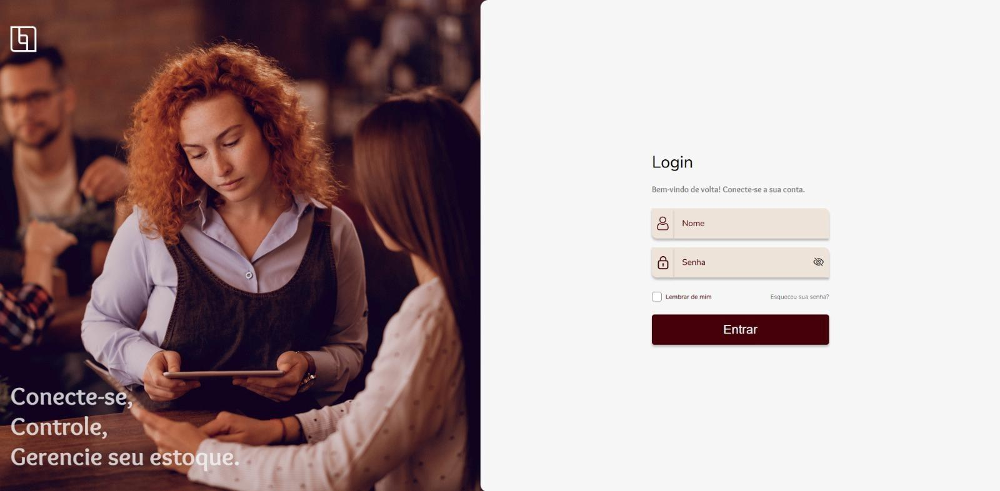

 Tela de Estoque

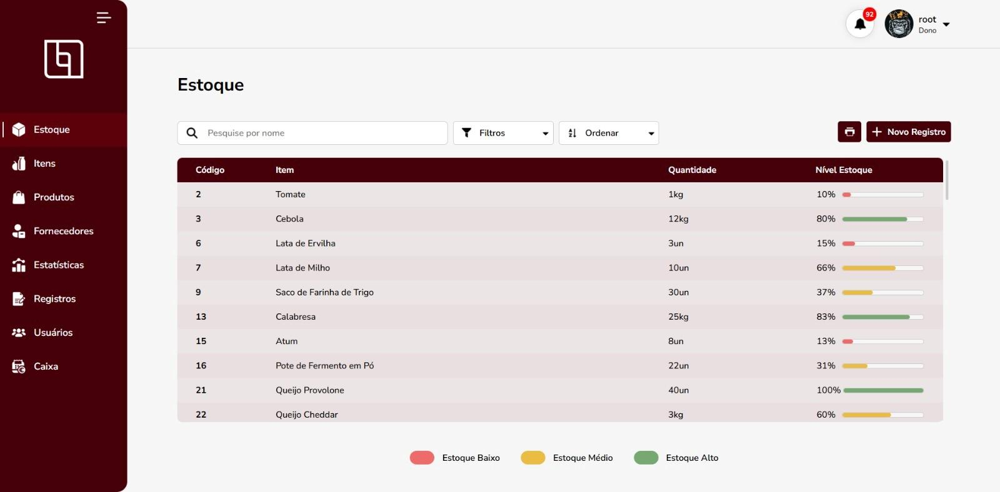

Tela de Itens

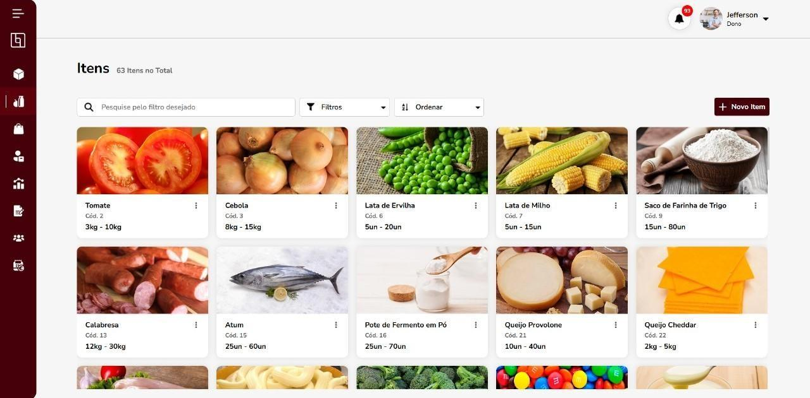

Tela de Produtos

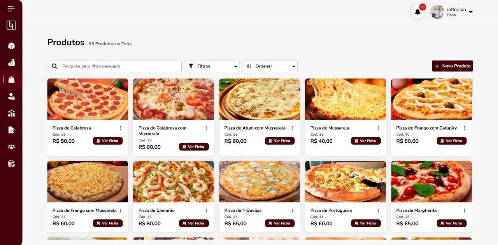

Tela de Fornecedores

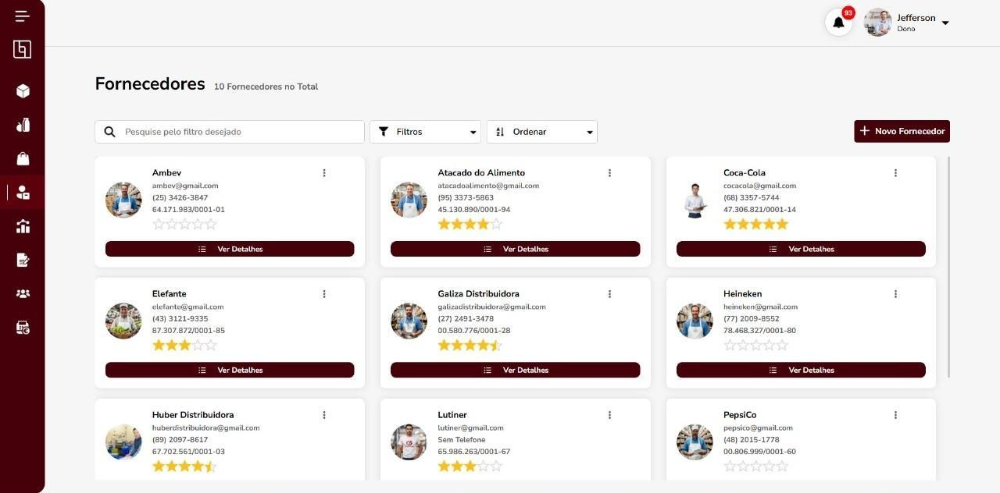

Tela de Estatísticas

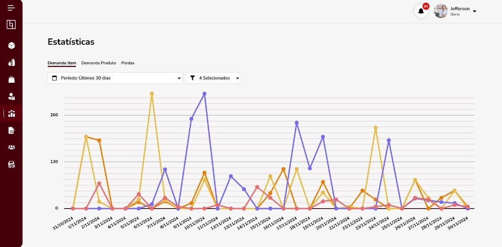

Tela de Registros

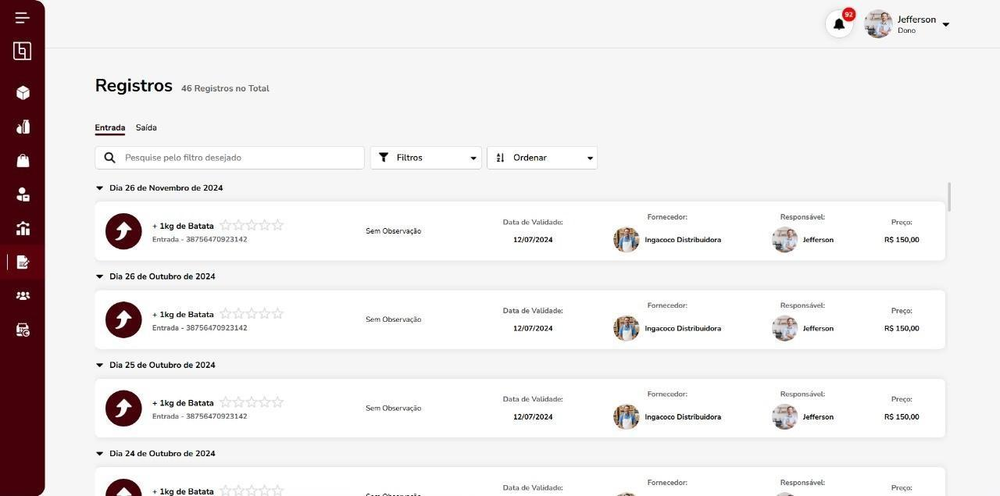

Tela de Usuários

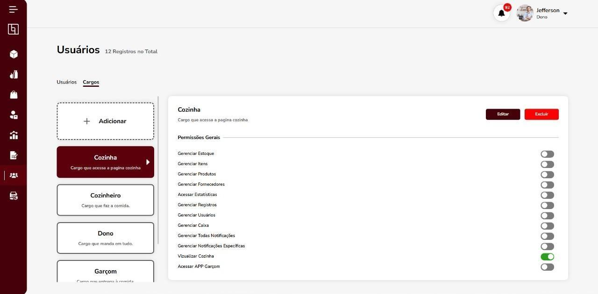

Tela de Caixa

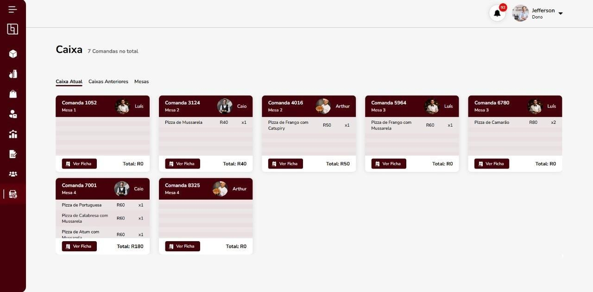

---

## Sistema de Pedido

### Aplicativo Mobile Ionic

Tela de Login

Tela de Mesas

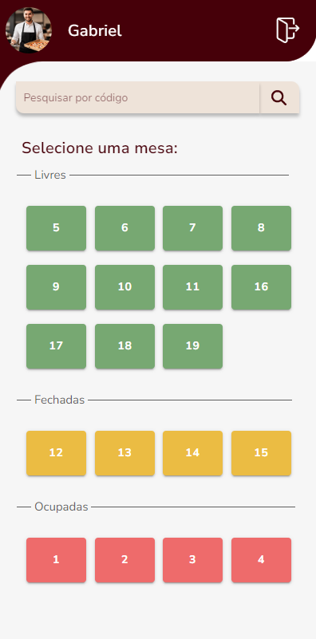

 Tela da Mesa

Tela da Comanda

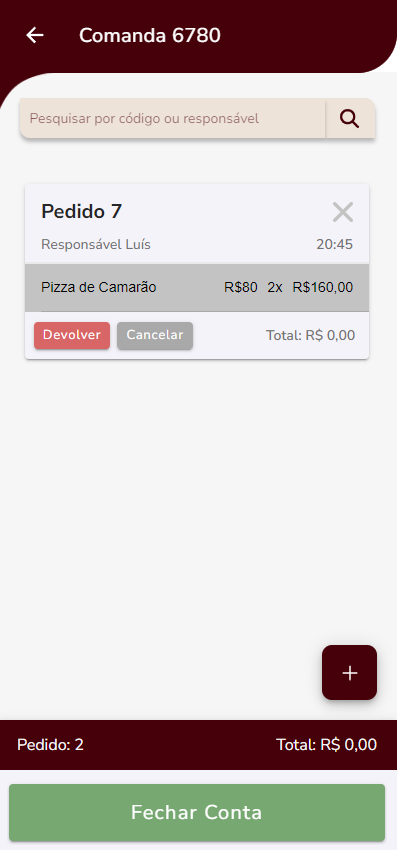

 Tela do Pedido

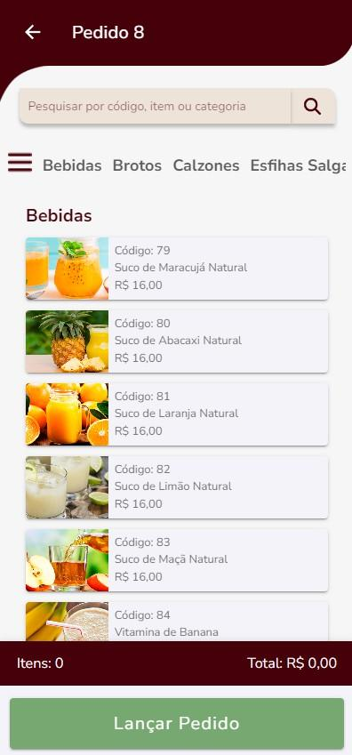

Tela de Fechamento de Conta

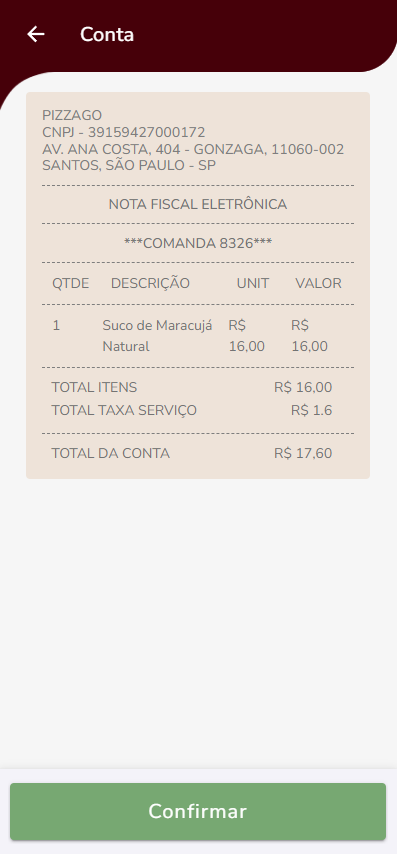

---

### Cozinha ASP Net Framework

Tela de Pedidos

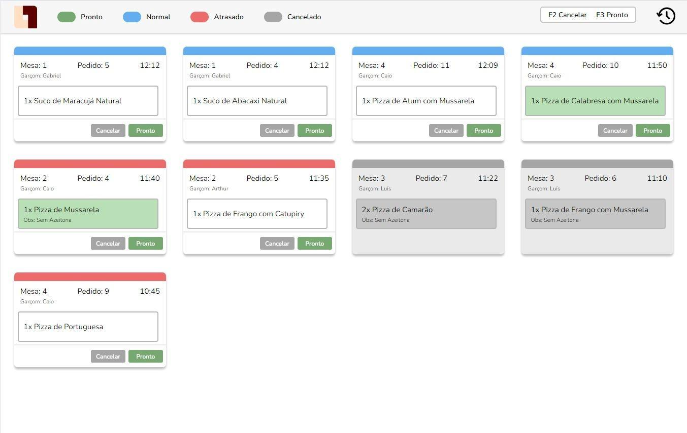

Tela de Histórico de Pedidos

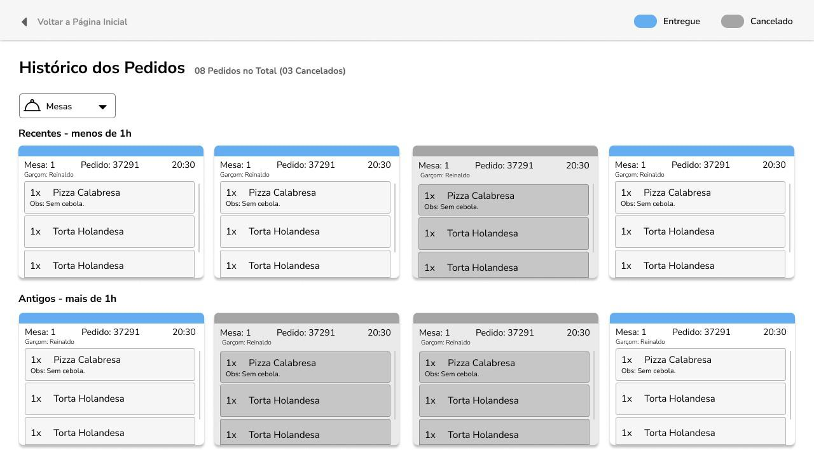

## English
Restaurant management system developed as a final degree project, featuring inventory, orders, employee management, and business statistics.

The project’s focus is to attract medium to large growing companies that lack efficient control systems, aiming to facilitate the overall dynamics of the establishment, increase productivity, and avoid food waste, which results not only in physical stock loss but also in financial deficit.

