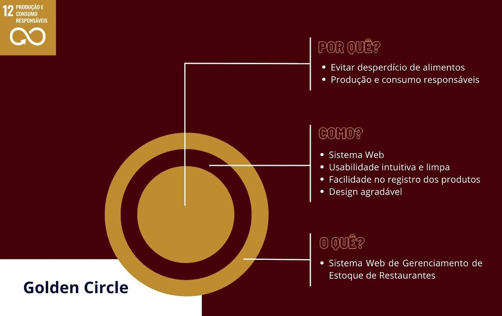

# Escopo

O **Projeto** foi desenvolvido para o controle de estoques na esfera dos restaurantes, sendo sua principal característica ser um software **online**, ou seja, hospedado na web. Ele é totalmente voltado para o **controle de quantidades de insumos** e **gerenciamento de pedidos**.

## Golden Circle

A imagem apresentada acima representa o **modelo Golden Circle**, metodologia criada por Simon Sinek para a definição de propósitos e objetivos que gerem impacto.

O gráfico é dividido em três grandes pontos:

- **Por quê (Why):** explica os motivos para a realização do projeto.
- **Como (How):** descreve o processo de como colocar a ideia em prática, sempre aplicando os motivos definidos anteriormente.
- **O quê (What):** define o produto final, ou seja, o projeto que será entregue.

Esse modelo permite compreender de forma clara o **escopo e propósito do sistema**.

## Estrutura do Sistema

O projeto é dividido em **três partes essenciais**:

### 1. Sistema Web
Interface principal onde o usuário tem acesso a todos os dados do restaurante, incluindo:

- Quantidades de estoque
- Registros de entrada e saída de insumos
- Cadastro de fornecedores
- Avaliações de entregas
- Gráficos de estatísticas
- Controle de caixa
- Pedidos do dia
- Histórico de pedidos de dias anteriores

### 2. Aplicativo de Comandas
Aplicativo desenvolvido para **facilitar o trabalho dos garçons**, permitindo:

- Registro de pedidos realizados
- Atualização de pedidos enviados
- Registro de pedidos cancelados

### 3. Interface da Cozinha
Ambiente voltado para os cozinheiros acompanharem os pedidos do restaurante, incluindo:

- Pedidos mais recentes
- Pedidos atrasados
- Pedidos prontos
- Pedidos cancelados

## Definição de Funcionalidades

Para evitar que o projeto se tornasse confuso ou apresentasse os mesmos problemas encontrados em sistemas similares, foi definida uma **lista restrita de funcionalidades e requisitos**, garantindo uma estrutura clara, organizada e focada nas necessidades principais do sistema.